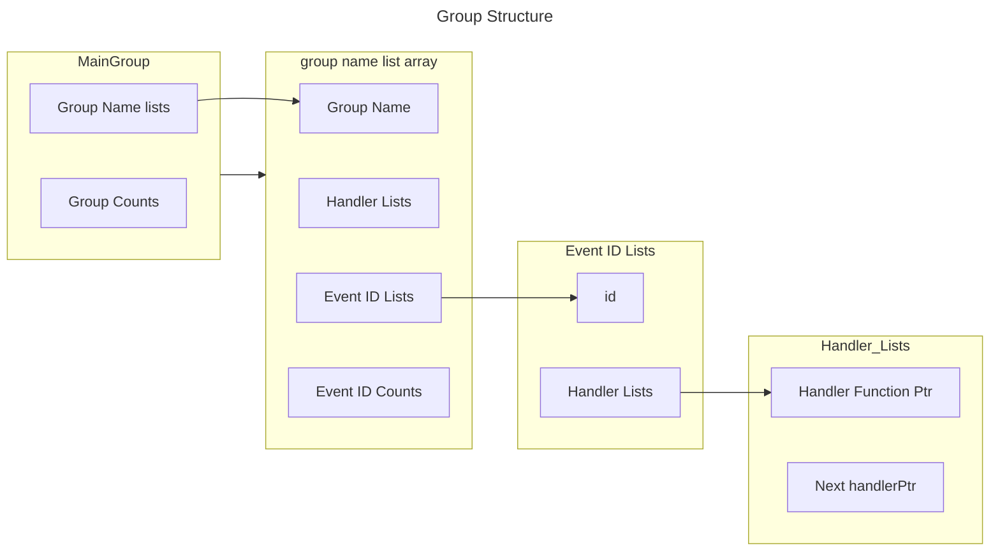
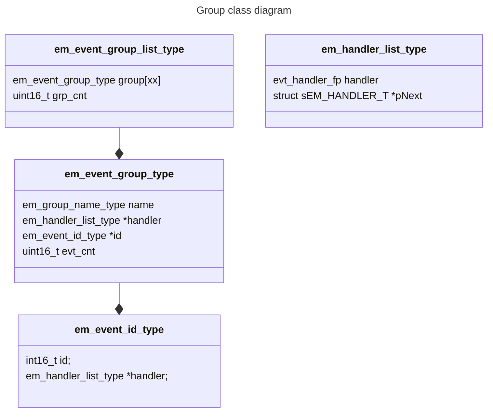

# EVENT MANAGER 2 
- Event Group이 존재 하고 그 그룹에는 그룹 전체의 handler와 다수의 event가 존재 한다.
- 각각의 event에는 다수의 handler가 존재 할 수 있다.

```text
-. 예로 "ETHERNET_EVT"그룹이 존재 할 경우
    1. 그룹 전체 handler: 그룹 모든 event에 대해 handler수행
```







